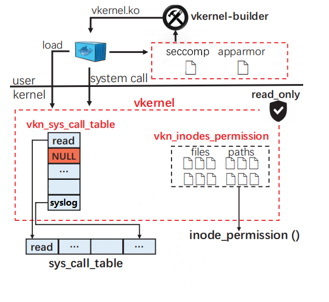

# Vkernel

简体中文 | [English](docs/README_EN.md)

## 介绍

一个 Linux 平台下用于容器的可定制、可插拔的轻量级虚拟内核。



`vkernel` （virtual kernel）基于内核可加载模块技术在内核层实现虚拟内核，旨在打破容器场景下的内核共享的局限性，实现容器独立的虚拟内核。

vkernel 包含如下几个部分：

- **module**：vkernel 内核模块（vkernel.ko, vkernel_hook.ko）。它们是 vkernel 的核心部分，为容器实现内核资源的虚拟化及安全防护。
- **builder**：vkernel 内核模块构建工具，用于分析容器镜像系统调用，基于 seccomp、apparmor 规则自动化构建 vkernel 内核模块。
- **runtime**：一个调用 vkernel 内核模块的容器运行时。运行时兼容 [OCI](https://github.com/opencontainers/runtime-spec) 标准，基于 [runc 1.0.0-rc92](https://github.com/opencontainers/runc/tree/v1.0.0-rc92)。
- **kernel**：运行 vkernel 内核模块的 Linux 内核，基于 [Linux 5.7](https://github.com/torvalds/linux/tree/v5.7)。

## 特性

目前，经历了初赛和复赛的迭代开发，vkernel 推出了两个版本，实现了如下特性：

- **虚拟内核安全隔离**
  - **系统调用隔离(持续开发中)**：
    - 为容器创建独立的系统调用表 ( `v0.1` )
    - 以futex子系统为例实现容器隔离的 *futex()* 系统调用 ( `v0.2` )
  - **文件访问控制( `v0.1` )**：基于 inode 虚拟化实现文件及目录的自定义访问规则。
  - **进程权限控制( `v0.1` )**：面向容器进程的双重 Capabilities 防护。
  - **内核日志隔离( `v0.2` )**：为容器实现隔离的内核日志访问。
  
- **虚拟内核构建流程**
  - **自动构建工具( `v0.1` )**：基于 apparmor 和 seccomp 配置文件自动构建 vkernel 模块。

我们将在下个版本中实现对 Linux 的 `调度子系统` 和 `内存子系统` 的隔离

## 准备

Vkernel 目前支持的平台有 Ubuntu 18.04、Ubuntu 20.04。其他 Linux 发行版暂未经过测试。

你需要提前安装以下工具：

- Docker
- Docker-slim
- Go (版本 >= 1.14)
- Python3
- Make、Gcc 及其他编译内核的库

也可以使用我们提供的Docker镜像 [rehgar/vkn_compiler](https://hub.docker.com/r/rehgar/vkn_compiler) 进行内核 (vkernel_kernel) 和运行时 (vkernel_runc) 的编译 

## 安装

clone 仓库。

```bash
$ git clone https://gitlab.eduxiji.net/hustcgcl/project788067-109547.git
```

### 安装 Linux 内核

```bash
$ cd vkernel_kernel
```

具体参考 Linux 内核编译安装方式。

注：需要在配置文件中增加 `CONFIG_VKERNEL=y` 以支持Vkernel，我们在此提供一份适用于Ubuntu 20.04的 [config-5.7.0](configs/config-5.7.0) 文件。

### 安装 vkernel 内核模块

1. 如果你想给 vkernel 模块自定义 seccomp、apparmor 规则，可以继续往下，否则直接跳到**第 2 步**。

   先进入构建工具目录。

   ```bash
   $ cd vkernel/vkernel_builder
   ```

- 自定义 seccomp 规则。**（可选，推荐）**

  其中，`-i` 指定 seccomp 的 profile 文件（[示例](https://github.com/moby/moby/blob/master/profiles/seccomp/default.json)），`-o` 指定生成 seccomp 相关代码的目录，`-s` 指定 syscall.c 模板文件。

  ```bash
  $ python3 seccomp.py -i myseccomp.json -o ../vkernel_module/vKI -s ./input/syscall.c
  # 例如
  # python3 seccomp.py -i ./input/default.json -o ../vkernel_module/vKI -s ./input/syscall.c
  ```

- 自定义 apparmor 规则。**（可选，推荐）**

  其中，`-i` 指定 apparmor 的 profile 文件（[示例](https://github.com/moby/moby/blob/master/profiles/apparmor/template.go)），`-o` 指定生成 apparmor 相关代码的目录，`-v` 指定 apparmor.c 模板文件。

  ```bash
  $ python3 apparmor.py -i myapparmor -o ../vkernel_module/vKI -v ./input/apparmor.c
  # 例如
  # python3 apparmor.py -i ./input/docker-nginx -o ../vkernel_module/vKI -v ./input/apparmor.c
  ```

- 如果你不想通过上面两种方式自定义 seccomp 和 apparmor 规则，可以指定一个 `my.json` 配置文件，然后使用 **root** 用户运行如下命令，通过 [docker-slim](https://github.com/docker-slim/docker-slim) 生成相应规则。

  ```bash
  $ python3 main.py -i my.json -o ../vkernel_module/vKI -s ./input/syscall.c -v ./input/apparmor.c
  # 例如
  # sudo python3 main.py -i ./input/nginx.json -o ../vkernel_module/vKI -s ./input/syscall.c -v ./input/apparmor.c
  ```

  其中，`my.json` 格式如下：

  ```json
  {
  	"name": "nginx",
  	"image-url": "nginx",
  	"label" : "",
  	"opts": ""
  }
  ```

  其中，`name` 是自定义的名字，`image-url` 为 docker 镜像名，`label` 为 docker 镜像标签，`opt` 为 docker-slim 命令选项。

2. 进入 vkernel 模块目录，编译内核模块安装。

   ```bash
   $ cd vkernel_module/vKM
   $ make
   $ sudo insmod vkernel_hook.ko
   $ cd ../vKI
   $ make
   $ sudo make install
   ```

### 安装 vkernel 运行时

1. 编译生成 vkernel 运行时

   ```bash
   $ cd vkernel_runc
   $ make
   $ cp runc /usr/local/bin/vkernel-runtime
   ```

2. 给 docker 添加 vkernel 运行时

   编辑 `etc/docker/daemon.json`，添加如下内容：

   ```json
   {
   	"runtimes": {
           "vkernel-runtime": {
               "path": "/usr/local/bin/vkernel-runtime"
           }
       }
   }
   ```

   重启 docker 引擎 `sudo systemctl restart docker`。

## 使用

启动容器时添加 `--runtime=vkernel-runtime` 参数。

```bash
$ docker run --rm --runtime=vkernel-runtime -itd ubuntu /bin/bash
265d5c39c6a882ca531e9b5ed2d3c4d305f13f142cc1c9cd50246221b592e55b
$ lsmod | grep vkernel
vkernel_265d5c39c6a8    40960  0
```

## 测试

为了方便进行vkernel的测试工作，我们提供了[测试脚本](scripts/)。

1. 镜像拉取

你需要提前拉取以下镜像:

- perf-futex
```bash
$ docker pull d202181178/futex-test:latest
```

- nginx
```bash
$ docker pull nginx:latest
```

- apache-benchmark
```bash
$ docker pull jordi/ab:latest
```

- pwgen
```bash
$ docker pull backplane/pwgen:latest
```

2. 组件安装

如果你想进行不同容器运行时的对比，需要提前安装以下组件,否则直接跳到**第 3 步**：

- gVisor
- kata

具体参考 gVisor 和 kata 的安装方式。

3. 使用脚本进行测试

- Futex子系统测试
```bash
$ cd scripts/futex
使用默认运行时：
$ ./run.sh secure 10
使用其他运行时：
$ ./run.sh vkernel(kata/gvisor-ptrace/...) 10
```

- Nginx测试

```bash
$ cd scripts
使用默认运行时：
$ ./nginx.sh original
使用其他运行时：
$ ./nginx.sh vkernel-runtime(runsc/kata-runtime)
```


- Pwgen测试

```bash
$ cd scripts
使用默认运行时：
$ ./pwgen.sh original
使用其他运行时：
$ ./pwgen.sh vkernel-runtime(runsc/kata-runtime)
```


## 开发文档

见 [vkernel开发文档](docs/vkernel开发文档.pdf)

## 贡献

如果你对我们的项目感兴趣，欢迎在PR中提交！

## 证书

代码和文档根据 [GNU GENERAL PUBLIC LICENSE v2](./LICENSE) 许可发布。
