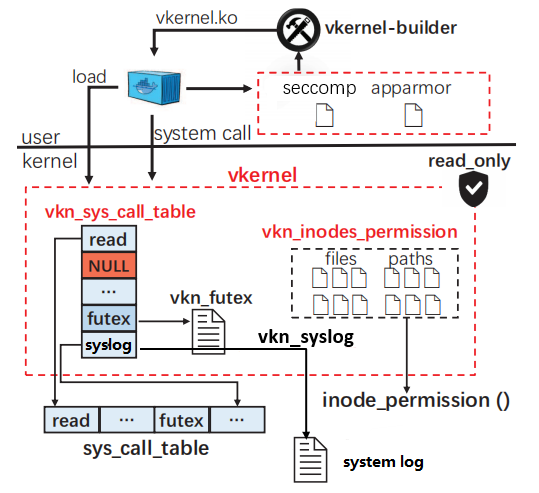

# Vkernel

English | [简体中文](../README.md)

## Introduction

A customizable, pluggable lightweight virtual kernel for containers on the Linux platform.



`vkernel` (virtual kernel) is based on the kernel loadable module technology to realize the virtual kernel in the kernel layer, aiming at breaking the limitation of kernel sharing in the container scenario and realizing the virtual kernel independent of the container.

vkernel contains the following parts:

- **module**: vkernel module (vkernel.ko). It's the key of VKernel, which realizes the virtualization and security of kernel resources for the container.
- **builder**: A tool for building vkernel module. It analyzes container images' system call and automatically build vkernel module based on seccomp, apparmor rules.
- **runtime**: A container runtime that calls the vkernel module. The runtime is [OCI](https://github.com/opencontainers/runtime-spec)-compatible and based on [runc 1.0.0-rc92](https://github.com/opencontainers/runc/tree/v1.0.0-rc92).
- **kernel**: The Linux kernel running the vkernel module, based on [Linux 5.7](https://github.com/torvalds/linux/tree/v5.7)。

## Features

vkernel implements the following features:

- **virtual kernel security isolation**
  - **system call isolation**: Creating a separate system call table for each container.
  - **file access control**: Implementing custom access rules for files and directories based on inode virtualization.
  - **process permission control**: Container-oriented dual Capabilities protection.
- **virtual kernel build process**
  - **automatic build tools**: Automatically build vkernel modules based on apparmor and seccomp profiles.

## Prerequisites

Vkernel currently supports Ubuntu 18.04 and Ubuntu 20.04. Other Linux distributions have not yet been tested.

You need to install the following tools in advance:

- Docker
- Docker-slim
- Go (Version >= 1.14)
- Python3
- Make、Gcc and other libraries used to build linux kernel

Or you can use the images we provide(docker pull rehgar/vkn_compiler) to compile the kernel (vkernel_kernel) and runtime (vkernel_runc)
## Installation

Clone the repository.

```bash
$ git clone https://gitlab.eduxiji.net/hustcgcl/project788067-109547.git
```

### Install Linux kernel

```bash
$ cd vkernel_kernel
```

For details, refer to the Linux kernel compilation and installation method.

### Install vkernel module

1. If you want to customize the seccomp or apparmor rules for the vkernel module, continue. Otherwise, skip to **Step 2**.

   Entry the build tools directory Firstly.

   ```bash
   $ cd vkernel/vkernel_builder
   ```

- Custom seccomp rules. **(Optional, recommended)**

  Where, `-i` specifies the seccomp file ([example](https://github.com/moby/moby/blob/master/profiles/seccomp/default.json)), `-o` specifies the directory where seccomp related code is generated, and `-s` specifies the syscall.c template file.

  ```bash
  $ python3 seccomp.py -i myseccomp.json -o ../vkernel_module -s ./input/syscall.c
  # For example
  # python3 seccomp.py -i ./input/default.json -o ../vkernel_module -s ./input/syscall.c
  ```

- Custom apparmor rules. **(Optional, recommended)**

  Where, `-i` specifies the apparmor file ([example](https://github.com/moby/moby/blob/master/profiles/apparmor/template.go)), `-o` specifies the directory where apparmor related code is generated, and `-s` specifies the apparmor.c template file.

  ```bash
  $ python3 apparmor.py -i myapparmor -o ../vkernel_module -v ./input/apparmor.c
  # For example
  # python3 apparmor.py -i ./input/docker-nginx -o ../vkernel_module -v ./input/apparmor.c
  ```

- If you don't want to customize the seccomp and apparmor rules in the above two ways, you can specify a `my.json` configuration file and then run the following command using **root** to generate the corresponding rules by [docker-slim](https://github.com/docker-slim/docker-slim).

  ```bash
  $ python3 main.py -i my.json -o ../vkernel_module -s ./input/syscall.c -v ./input/apparmor.c
  # For example
  # sudo python3 main.py -i ./input/nginx.json -o ../vkernel_module -s ./input/syscall.c -v ./input/apparmor.c
  ```

  The `my.json` format is as follows：

  ```json
  {
  	"name": "nginx",
  	"image-url": "nginx",
  	"label" : "",
  	"opts": ""
  }
  ```

  Where, `name` is your custom name, `image-url` is docker image's name, `label` is docker image's tag, `opt` is docker-slim command option.

2. Enter the vkernel module directory, compile the kernel module and install it.

   ```bash
   $ cd vkernel_module
   $ make
   $ sudo make install
   ```

### Install vkernel runtime

1. Compile and generate the vkernel runtime

   ```bash
   $ cd vkernel_runc
   $ make
   $ cp runc /usr/local/bin/vkernel-runtime
   ```

2. Add vkernel runtime to docker

   Edit `etc/docker/daemon.json`，add the following：

   ```json
   {
   	"runtimes": {
           "vkernel-runtime": {
               "path": "/usr/local/bin/vkernel-runtime"
           }
       }
   }
   ```

   Restart docker engine `sudo systemctl restart docker`。

## Usage

Using `--runtime=vkernel-runtime` parameter when starting a container.

```bash
$ docker run --rm --runtime=vkernel-runtime -itd ubuntu /bin/bash
265d5c39c6a882ca531e9b5ed2d3c4d305f13f142cc1c9cd50246221b592e55b
$ lsmod | grep vkernel
vkernel_265d5c39c6a8    40960  0
```

## Contribution

If you are interested in our project, welcome to submit PRs.

## License

The code and docs are released under the GNU GENERAL PUBLIC LICENSE v2.
